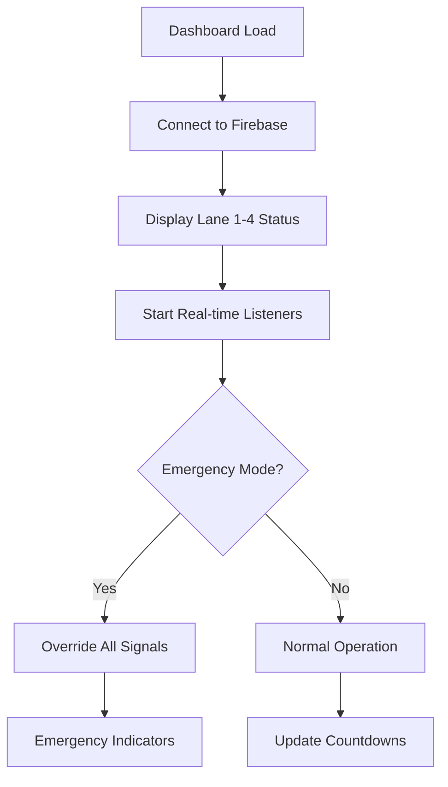

## 1. Product Overview
A real-time 4-lane traffic management dashboard that enables traffic operators to monitor and control traffic flow through visual indicators and countdown timers. The system provides live updates via Firebase Firestore and includes emergency override capabilities for critical situations.

This dashboard helps traffic control centers efficiently manage intersections by providing instant visual feedback on lane status and remaining signal time, while allowing operators to upload camera feeds and activate emergency protocols when needed.

## 2. Core Features

### 2.1 User Roles
| Role | Registration Method | Core Permissions |
|------|---------------------|------------------|
| Traffic Operator | Admin-assigned credentials | View all lanes, control emergency mode, upload camera feeds |
| System Admin | Master account setup | Full system control, user management, configuration |

### 2.2 Feature Module
The traffic management dashboard consists of the following main components:
1. **Dashboard page**: 4-lane traffic display, traffic light indicators, countdown timers, camera upload buttons.
2. **Emergency control panel**: Global emergency mode toggle, system status indicators.
3. **Camera management**: Video feed upload interface for each lane.

### 2.3 Page Details
| Page Name | Module Name | Feature description |
|-----------|-------------|---------------------|
| Dashboard | Lane Status Display | Show 4 lanes with real-time traffic light status (Red/Green) and countdown timers. |
| Dashboard | Emergency Control | Toggle global emergency mode that overrides all lane signals. |
| Dashboard | Camera Upload | Upload button for each lane to simulate video feed connection. |
| Dashboard | Real-time Sync | Automatically update lane status from Firebase Firestore 'lane_stats' collection. |

## 3. Core Process
**Traffic Operator Flow:**
1. Operator logs into the dashboard
2. System displays current status of all 4 lanes with traffic lights and countdowns
3. Real-time updates occur automatically via Firebase Firestore listeners
4. Operator can activate emergency mode to override all signals
5. Operator can upload camera feeds for visual verification

**System Flow:**

## 4. User Interface Design

### 4.1 Design Style
- **Primary Colors**: Traffic light colors (Red: #FF0000, Green: #00FF00, Yellow: #FFFF00)
- **Secondary Colors**: Dark background (#1a1a1a) with high contrast for visibility
- **Button Style**: Rounded corners, clear hover states, emergency button in bright orange
- **Font**: Sans-serif, large sizes for dashboard readability (minimum 16px)
- **Layout**: Grid-based 2x2 layout for 4 lanes, centered emergency controls
- **Icons**: Traffic light symbols, camera icons, emergency warning symbols

### 4.2 Page Design Overview
| Page Name | Module Name | UI Elements |
|-----------|-------------|-------------|
| Dashboard | Lane Grid | 2x2 grid layout, each lane card with traffic light icon, countdown display, camera upload button |
| Dashboard | Emergency Panel | Prominent orange toggle button, status indicator light, warning text |
| Dashboard | Header | System title, current time, connection status indicator |

### 4.3 Responsiveness
Desktop-first design with mobile-adaptive layout. Primary use case is desktop monitoring stations, but responsive for tablet viewing. Touch interaction optimized for emergency controls.

### 4.4 Real-time Update Guidance
- Firebase Firestore listeners update lane status every 100ms
- Smooth countdown animations without page refresh
- Visual indicators for connection status (online/offline)
- Error handling for failed updates with retry mechanisms