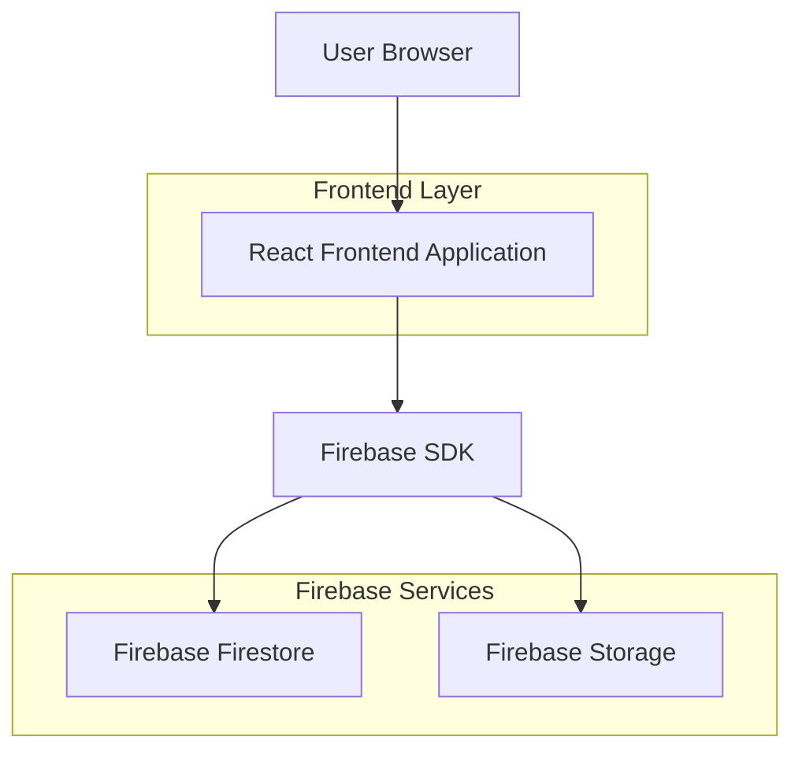
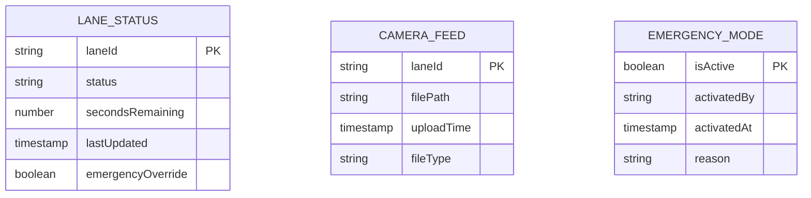

## 1. Architecture design



## 2. Technology Description
- Frontend: React@18 + tailwindcss@3 + vite
- Initialization Tool: vite-init
- Backend: Firebase Firestore + Firebase Storage
- Real-time Database: Firebase Firestore 'lane_stats' collection
- File Storage: Firebase Storage for camera uploads

## 3. Route definitions
| Route | Purpose |
|-------|---------|
| / | Dashboard page, displays 4-lane traffic management interface |
| /login | Authentication page for traffic operators |
| /admin | Admin panel for system configuration |

## 4. API definitions

### 4.1 Firebase Firestore Collections

**lane_stats Collection**
```javascript
// Document structure for each lane (lane1, lane2, lane3, lane4)
{
  laneId: string,        // "lane1" | "lane2" | "lane3" | "lane4"
  status: string,        // "red" | "green" | "yellow"
  secondsRemaining: number,  // 0-120 seconds
  lastUpdated: timestamp,
  emergencyOverride: boolean   // true when emergency mode active
}
```

### 4.2 Firebase Storage Structure
```javascript
// Camera upload path structure
/camera-feeds/
  ├── lane1/
  │   └── timestamp_feed.mp4
  ├── lane2/
  │   └── timestamp_feed.mp4
  ├── lane3/
  │   └── timestamp_feed.mp4
  └── lane4/
      └── timestamp_feed.mp4
```

### 4.3 Real-time Listeners
```javascript
// Firestore real-time subscription
const unsubscribe = onSnapshot(
  collection(db, 'lane_stats'),
  (snapshot) => {
    // Handle real-time updates for all lanes
    snapshot.docChanges().forEach((change) => {
      if (change.type === 'modified') {
        // Update lane status in UI
        updateLaneDisplay(change.doc.data());
      }
    });
  }
);
```

## 5. Server architecture diagram
Not applicable - Firebase provides backend services without custom server implementation.

## 6. Data model

### 6.1 Data model definition


### 6.2 Data Definition Language
**lane_stats Collection (Firestore)**
```javascript
// Firestore collection: lane_stats
// Document ID: lane1, lane2, lane3, lane4
{
  "laneId": "lane1",
  "status": "green",
  "secondsRemaining": 45,
  "lastUpdated": "2025-12-26T10:30:00Z",
  "emergencyOverride": false
}

// Firestore security rules
rules_version = '2';
service cloud.firestore {
  match /databases/{database}/documents {
    match /lane_stats/{laneId} {
      allow read: if request.auth != null;
      allow write: if request.auth != null && 
        request.auth.token.admin == true;
    }
  }
}
```

**camera_feeds Collection (Firestore)**
```javascript
// Firestore collection: camera_feeds
{
  "laneId": "lane1",
  "filePath": "camera-feeds/lane1/20251226_103000_feed.mp4",
  "uploadTime": "2025-12-26T10:30:00Z",
  "fileType": "video/mp4"
}
```

**emergency_mode Collection (Firestore)**
```javascript
// Firestore collection: emergency_mode
// Document ID: global
{
  "isActive": false,
  "activatedBy": "operator123",
  "activatedAt": "2025-12-26T10:30:00Z",
  "reason": "Traffic incident on main road"
}
```

## 7. Component Architecture

### 7.1 React Component Structure
```javascript
// Main components hierarchy
App
├── AuthProvider
├── Dashboard
│   ├── Header
│   ├── LaneGrid
│   │   ├── LaneCard (x4)
│   │   │   ├── TrafficLight
│   │   │   ├── CountdownTimer
│   │   │   └── CameraUpload
│   │   └── EmergencyControl
│   └── StatusBar
└── Login
```

### 7.2 State Management
```javascript
// React Context for global state
const TrafficContext = createContext({
  lanes: {},
  emergencyMode: false,
  connectionStatus: 'connected',
  updateLane: (laneId, data) => {},
  toggleEmergency: () => {}
});
```

## 8. Performance Considerations
- Implement React.memo for lane components to prevent unnecessary re-renders
- Use Firestore query limits to reduce data transfer
- Implement debouncing for emergency mode toggles
- Cache camera upload URLs to reduce storage API calls
- Use React.lazy for code splitting of admin components