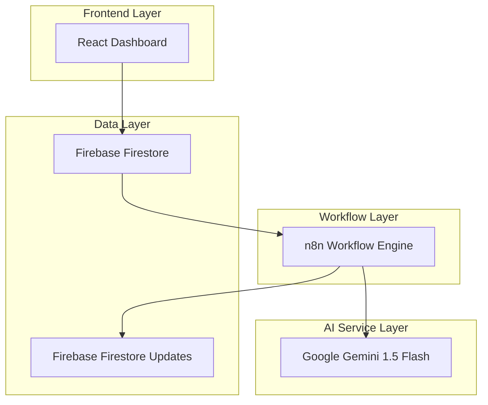
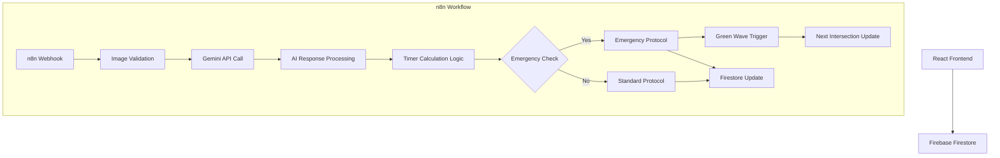
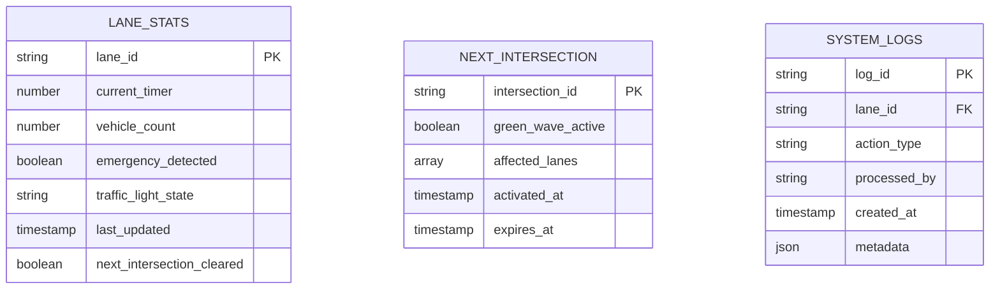

## 1. Architecture Design



## 2. Technology Description

- **Frontend**: React@18 + TailwindCSS@3 + Vite
- **Initialization Tool**: vite-init
- **Backend**: n8n (workflow orchestration)
- **AI Service**: Google Gemini 1.5 Flash API
- **Database**: Firebase Firestore
- **Real-time Sync**: Firebase Realtime Listeners

## 3. Route Definitions

| Route | Purpose |
|-------|---------|
| / | Traffic Dashboard - Main 4-lane display with traffic controls |
| /status | System Status - AI processing status and system health monitoring |

## 4. API Definitions

### 4.1 n8n Webhook Integration

**Webhook Endpoint**: `POST /webhook/traffic-analysis`

**Request Format**:
```json
{
  "lane_id": "lane_1|lane_2|lane_3|lane_4",
  "image_base64": "base64_encoded_image_string",
  "timestamp": "2024-01-01T12:00:00Z"
}
```

**Response Format**:
```json
{
  "status": "success|error",
  "lane_id": "lane_1",
  "vehicle_count": 15,
  "emergency_detected": false,
  "calculated_timer": 50,
  "processed_at": "2024-01-01T12:00:01Z"
}
```

### 4.2 Firebase Firestore Structure

**Collection**: `lane_stats`
```typescript
interface LaneStats {
  lane_id: string;
  current_timer: number;
  vehicle_count: number;
  emergency_detected: boolean;
  traffic_light_state: 'red' | 'green' | 'yellow';
  last_updated: Timestamp;
  next_intersection_cleared: boolean;
}
```

**Collection**: `next_intersection`
```typescript
interface NextIntersection {
  intersection_id: string;
  green_wave_active: boolean;
  affected_lanes: string[];
  activated_at: Timestamp;
  expires_at: Timestamp;
}
```

## 5. Server Architecture Diagram



## 6. Data Model

### 6.1 Data Model Definition



### 6.2 Data Definition Language

**Lane Stats Collection Structure**:
```javascript
// Firestore collection: lane_stats
{
  "lane_1": {
    "current_timer": 45,
    "vehicle_count": 13,
    "emergency_detected": false,
    "traffic_light_state": "green",
    "last_updated": "2024-01-01T12:00:00Z",
    "next_intersection_cleared": false
  },
  "lane_2": {
    "current_timer": 0,
    "vehicle_count": 8,
    "emergency_detected": false,
    "traffic_light_state": "red",
    "last_updated": "2024-01-01T12:00:00Z",
    "next_intersection_cleared": false
  }
}
```

**Next Intersection Collection Structure**:
```javascript
// Firestore collection: next_intersection
{
  "intersection_1": {
    "green_wave_active": true,
    "affected_lanes": ["lane_1", "lane_3"],
    "activated_at": "2024-01-01T12:00:00Z",
    "expires_at": "2024-01-01T12:01:00Z"
  }
}
```

**Timer Calculation Logic**:
```javascript
// Standard Protocol
function calculateStandardTimer(vehicleCount) {
  const baseTime = (vehicleCount * 3) + 5;
  return Math.max(10, Math.min(60, baseTime));
}

// Emergency Protocol
function calculateEmergencyTimer(emergencyLane) {
  return {
    [emergencyLane]: 60, // 60 seconds green
    otherLanes: 0        // 0 seconds red
  };
}
```

**Firebase Security Rules**:
```javascript
// Allow read access to all users
match /lane_stats/{lane_id} {
  allow read: if true;
  allow write: if request.auth != null;
}

match /next_intersection/{intersection_id} {
  allow read: if true;
  allow write: if request.auth != null;
}
```